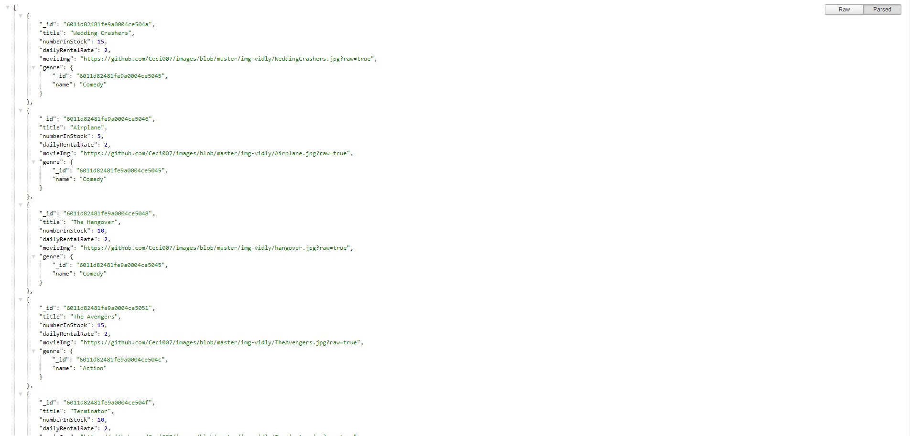
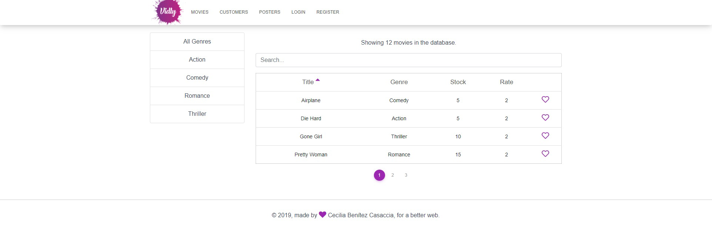

## Introduction

This project is the backend and frontend of vidly, an imaginary video rental app.

## Live Demo 

[vidly (movie rentals)](https://movie-rentals.netlify.app/movies)

## Setup

Make sure to follow all these steps exactly as explained below. Do not miss any steps or you won't be able to run this application.

### Install MongoDB

 To run this project, you need to install the latest version of MongoDB Community Edition first.

https://docs.mongodb.com/manual/installation/

Once you install MongoDB, make sure it's running.

### Install the Dependencies

Next, from the project folder, install the dependencies:

 npm i

### Populate the Database

 node seed.js

### Start the Server

 node index.js 

This will launch the Node server on port 3900. If that port is busy, you can set a different point in config/default.json.

Open up your browser and head over to:

http://localhost:3900/api/genres

 You should see the list of genres. That confirms that you have set up everything successfully.

### (Optional) Environment Variables

If you look at config/default.json, you'll see a property called jwtPrivateKey. This key is used to encrypt JSON web tokens. So, for security reasons, it should not be checked into the source control. I've set a default value here to make it easier for you to get up and running with this project. For a production scenario, you should store this key as an environment variable.

 On Mac export vidly_jwtPrivateKey=yourSecureKey

. On Windows:

 set vidly_jwtPrivateKey=yourSecureKey. the frontend is in the client folder it's build with react so you should install this with all the dependencies then you should run npm start, but for running both backend and frontend we recomend to use the comand npm run dev.
